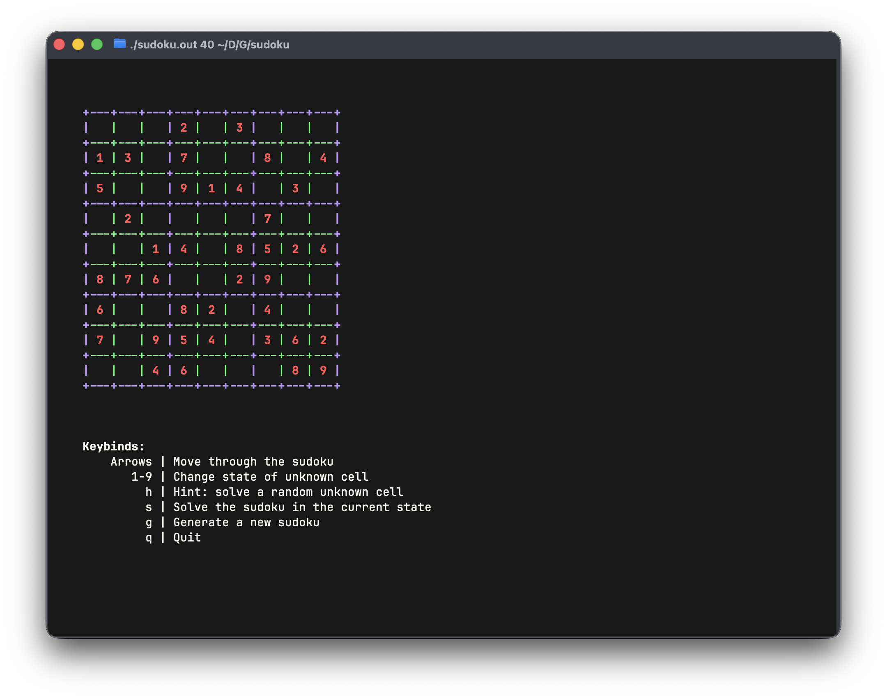
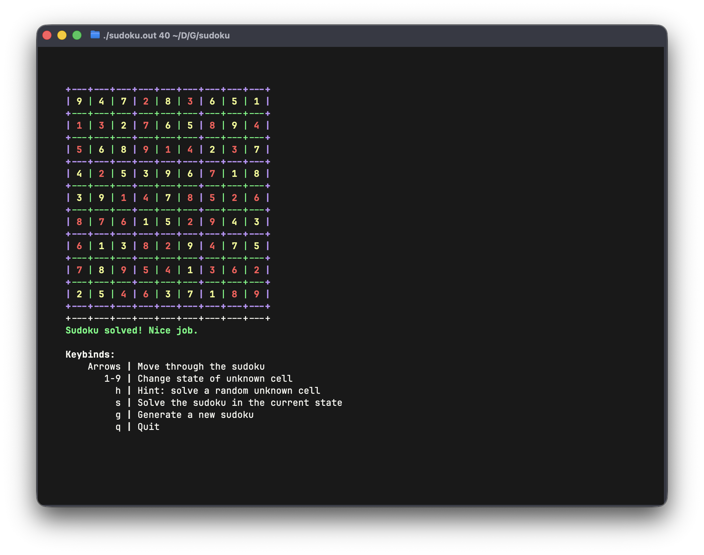

# Sudoku

**Simple sudoku for the terminal using ncurses and written in C.**




### Building

Simply run:

```bash
git clone https://github.com/warshanks/sudoku
cd sudoku

# For the game itself
make sudoku.out

# From a simple text solver
make solver.out

# Or both at once
make
```

If you don't want the **game** to show colors (for ncurses) simply comment this line in `src/game/globals.h`.

If you don't want the **solver** program to show colors (for example for some windows terminals or for redirecting the output) simply comment this line in `src/solver/defines.h`

```c
/*
 * Comment this line if you don't want colors!
 * Will not print with colors if not defined, useful for redirecting the output of
 * the command.
 */
#define USE_COLOR
```

### Playing the game

Simply run:

```console
$ ./sudoku.out --help
Usage:
    ./sudoku.out            - Run with default difficulty.
    ./sudoku.out <number>   - Where number is the number of cells that are going to be filled. [1-80]
```

### Using the solver

The solver program will try to read from the filename specified as argument, or stdin if none. The program checks if stdin is a piped file or command output (only on linux) and prints the usage if not.

```console
$ ./solver.out filename.txt
...

$ ./solver.out < filename.txt
...

$ cat filename.txt | ./solver.out
...

$ ./solver.out      # Will only check for pipes on linux
Usage:
    ./solver.out file.txt
    ./solver.out < file.txt

```
